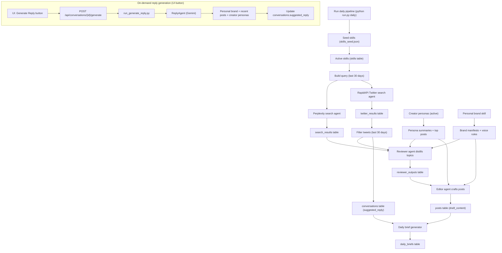

# X Agent OS Architecture

## Overview
Pulse OS hosts a shared SQLite database and two runtimes:

- `agent-service/`: Python pipeline for research, content generation, and daily briefs.
- `x-dashboard/`: Next.js + shadcn UI that reads/writes the same SQLite file.

## Data flow
1. `x_agent_os.orchestrator.run_daily_pipeline` runs skills through Perplexity/X/Gemini.
2. Results are stored in legacy tables (`sessions`, `search_results`, `twitter_results`, etc.).
3. New entities (`skills`, `posts`, `conversations`, `daily_briefs`, `metrics_snapshots`) are written for the dashboard.
4. The dashboard reads the shared DB and updates approvals or conversation statuses.

## Post + Reply Generation Diagram

## Shared SQLite
- Default path: `data/x_agent_os.db`
- Override with `X_AGENT_OS_DB_PATH`

## Future extensions
- Add a metrics provider in `x_agent_os/metrics.py`.
- Build `/sessions` and `/analytics` pages in `x-dashboard`.
